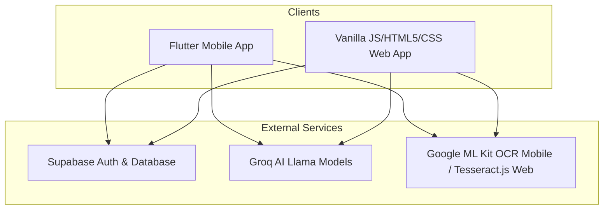

# PillsBee Application Explanation

**PillsBee** is a smart, AI-powered medication reminder and health assistant ecosystem designed to help users manage their medicine schedules, track inventory, and get immediate medical information. 

It is implemented as a multi-platform solution consisting of a **Flutter Mobile App** and a **Responsive Single-Page Web Application**, backed by a unified **Supabase** database and powered by **Groq AI**.

---

## 1. Technology Stack & Architecture



*   **Mobile App (Flutter):** Structured with a clean, feature-based architecture utilizing **Riverpod** for state management, **GoRouter** for routing, and Google ML Kit for on-device OCR.
*   **Web App (Vanilla Frontend):** Built using HTML5, Vanilla CSS (dynamic dark/light mode glassmorphic styling), and pure JS (`app.js`).
*   **Backend (Supabase):** Handles user authentication (Email/Password & Google OAuth), real-time database tables synchronization, and storage.
*   **AI Engine (Groq AI API):** Utilizes `llama-3.1-8b-instant` and `llama3-8b-8192` models to provide drug information lookup and a conversational chatbot assistant.

---

## 2. Core Features Breakdown

### 💊 Medicine Scheduler & Refill Alerts
*   **Flexible Schedules:** Users can add medicines with specific dosages, daily frequencies, multiple time slots, and expiry dates.
*   **Inventory Tracking:** Tracks total versus remaining pill counts. Every time a pill is marked as taken, the inventory decrements.
*   **Low Stock Alerts:** Highlights and issues alerts when the remaining quantity of any medicine falls below a threshold (e.g., 2 pills left) to prompt a refill.

### 🤖 AI-Powered Health Chatbot (PillsBee Assistant)
*   **Empathetic Conversations:** A chatbot powered by Groq's Llama models that acts as a friendly medical assistant.
*   **Database Archiving:** Chat history is saved in real-time to the Supabase `chat_history` table, enabling persistent chats across page refreshes.
*   **Safety Disclaimer:** A constant alert/header reminds the user: *"Consult your doctor before taking any medicine."*

### 📝 OCR Prescription Scanner
*   **Mobile:** Uses **Google ML Kit Text Recognition** to extract text from physical prescriptions captured via the mobile camera.
*   **Web:** Uses **Tesseract.js** in-browser to parse details out of uploaded images or camera captures.
*   **Autofill Logic:** Automatically extracts medicine names and dosage values (e.g., matching regular expressions like `500mg`, `10ml`) to pre-fill the medicine creation forms.

### 🔊 Voice Assistance & Screen Reader
*   **Audible Reminders:** Synthesizes voice alerts utilizing Speech Synthesis APIs to read schedule notifications out loud (*"It's time to take your Paracetamol, 500mg"*).
*   **Voice Control:** Allows toggling audio guidance on/off, choosing natural/premium voices, and modifying speech rates for accessibility.

### 🔍 Detailed Drug Information Cards
*   When a user clicks on a medicine card, the app requests Groq AI to return structured medical information in JSON:
    *   **Usage:** Brief explanation of what the medicine treats.
    *   **Dosage:** Standard dosage recommendations.
    *   **Side Effects:** Common adverse effects to watch out for.
    *   **Timing:** Optimal time to take it (e.g., before/after meals).

---

## 3. Database Schema Overview (Supabase)

The ecosystem revolves around three primary tables:

1.  **`medicines`**: Stores user-scheduled medications.
    *   `id` (UUID, Primary Key)
    *   `user_id` (UUID, Foreign Key pointing to Supabase Auth)
    *   `name` (Text)
    *   `dosage` (Text)
    *   `frequency` (Text)
    *   `time` (Text - stored as comma-separated slots)
    *   `total_quantity` (Int)
    *   `remaining_quantity` (Int)
    *   `expiry_date` (Date, Nullable)
    *   `voice_enabled` (Boolean)

2.  **`history`**: Logs each time a medicine is marked as taken.
    *   `id` (UUID, Primary Key)
    *   `user_id` (UUID, Foreign Key)
    *   `medicine_id` (UUID, Foreign Key)
    *   `medicine_name` (Text)
    *   `dosage` (Text)
    *   `remaining` / `remaining_quantity` (Int)
    *   `taken_at` (Timestamp)

3.  **`chat_history`**: Stores conversational context between users and PillsBee AI.
    *   `id` (UUID, Primary Key)
    *   `user_id` (UUID, Foreign Key)
    *   `role` ('user' or 'bot')
    *   `content` (Text)
    *   `created_at` (Timestamp)

---

## 4. Workspace Project Structure

The project code is divided into two major scopes inside the `d:\PillsBee` directory:

```bash
├── android/                    # Android-specific configuration
├── assets/                     # Static app resources
├── lib/                        # Flutter Mobile App Source Code
│   ├── main.dart               # App entrypoint (initializes cameras, Supabase, notifications)
│   └── src/
│       ├── core/               # Routing, themes, services (notifications, voice)
│       └── features/           # Modularized features
│           ├── auth/           # Login, registration widgets
│           ├── chatbot/        # Groq service & chat interface
│           ├── dashboard/      # Main dashboard & setting screens
│           ├── medicines/      # Medicine scheduler models, providers, & views
│           └── scanner/        # Google ML Kit OCR scan implementation
└── web_app/                    # Web Application Frontend
    ├── index.html              # Main HTML container (Glassmorphic panels)
    ├── style.css               # Vanilla CSS design stylesheet (Dark/Light themes)
    └── app.js                  # App controller (Supabase client, speech synthesizers, Tesseract.js OCR, Groq fetch)
```
